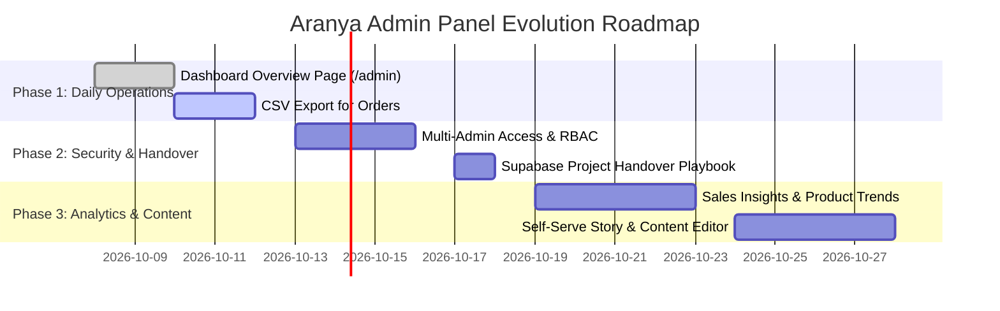

# Aranya Organic Dairy Farm — Admin Panel Evolution Plan & Technical Blueprint

> **Document Status**: Approved Architecture Plan  
> **Target Version**: Phase 2 Admin Expansion (`ARY-ADMIN-v2`)  
> **Focus**: Operational Efficiency, Data Resilience, Multi-Tenant Handover & Business Intelligence  

---

## Executive Summary & Impact Matrix

The Aranya Organic Dairy Farm web platform currently supports a high-performing storefront, real-time WhatsApp order dispatch, farm visit bookings, and individual administrative modules for Products, Orders, and Visits. 

However, the administration experience currently lacks a centralized operational cockpit. The following 5 features transform the admin panel from a collection of isolated database forms into a real, indispensable daily business operating system.

| Rank | Feature | Business Value & Justification | Operational Friction Solved | Complexity | Target Sprint |
|:---:|---|---|---|:---:|:---:|
| **1** | **Dashboard Overview** | **Highest Impact**. Centralized morning command center showing today's pending orders, low-stock items, new visit requests, and week's revenue. | Eliminates tab-jumping across 3 screens every morning; gives instant operational pulse. | Medium | **Sprint 1 (Immediate)** |
| **2** | **CSV Export for Orders** | **Critical Safety & Accounting**. Provides one-click order exports for tax/accounting books and acts as a manual backup safety net on Supabase free tier. | Solves lack of point-in-time automated backups on free tier; enables accounting spreadsheet reconciliation. | Low–Medium | **Sprint 1 (Immediate)** |
| **3** | **Multi-Admin Access** | **Ownership & Handover Readiness**. Enables inviting a second administrator with role controls prior to the Supabase project handover to the client. | Prevents developer lockout, stops credential sharing, and prepares seamless project transfer. | Medium | **Sprint 2** |
| **4** | **Sales Insights** | **Commercial Intelligence**. Answers real business questions: top-selling items, peak ordering days (weekends vs weekdays), and average order value. | Separates web traffic (Vercel Analytics) from actual commercial sales performance. | Medium | **Sprint 3** |
| **5** | **Self-Serve Content Editing** | **Client Independence**. Gives the farm owner the ability to edit the "Our Story" pillars, timeline, and announcement banner without developer code commits. | Removes ongoing developer bottleneck for seasonal updates and heritage messaging. | High | **Sprint 3** |

---

## Feature 1: Dashboard Overview (`/admin`)

### 1.1 Problem Statement
Currently, navigating to `/admin` triggers an immediate hard redirect to `/admin/products`. The store manager must click into `/admin/orders` to see if milk orders came in, click into `/admin/products` to inspect inventory, and click into `/admin/visits` to see if customers booked weekend farm visits. There is zero aggregate visibility.

### 1.2 Proposed Experience & Information Architecture
The root route `/admin` becomes an executive **Operational Home Dashboard** (`AdminDashboardPage`).

```
┌─────────────────────────────────────────────────────────────────────────────┐
│ 🏠 Aranya Farm Admin Dashboard                 [Export CSV] [Live Store ↗]  │
├─────────────────────────────────────────────────────────────────────────────┤
│ ┌──────────────┐  ┌──────────────┐  ┌──────────────┐  ┌───────────────────┐ │
│ │ 📦 Pending   │  │ ⚠️ Low Stock  │  │ 📅 Visits    │  │ 💰 This Week      │ │
│ │ Orders: 7    │  │ Items: 3     │  │ Requests: 4  │  │ Revenue: ₹14,850  │ │
│ │ [View Orders]│  │ [Restock]    │  │ [Confirm]    │  │ [+18% vs last wk] │ │
│ └──────────────┘  └──────────────┘  └──────────────┘  └───────────────────┘ │
├─────────────────────────────────────────────────────────────────────────────┤
│ ⚡ Quick Actions: [+ Add Product] [📥 Export Orders] [📋 Print Run Sheet]   │
├─────────────────────────────────────────────┬───────────────────────────────┤
│ 📋 Recent Pending Orders (Top 5)            │ 🚜 New Farm Visit Inquiries   │
│ • #0A3E78AD · A2 Milk (2L), Ghee · ₹830    │ • Karthik · 4 Visitors        │
│ • #9F12B44C · Farm Whole Milk · ₹180        │   Saturday (8-10 AM)          │
│ • #18C7E012 · Pure Vedic Ghee · ₹1,300      │   [Confirm] [Decline]         │
│   [View All Orders →]                       │   [View All Visits →]         │
└─────────────────────────────────────────────┴───────────────────────────────┘
```

### 1.3 Key Metrics Definition
1. **Today's Pending Orders**:
   - Query: `orders` where `status = 'pending'` and `created_at >= start_of_day`.
   - Secondary indicator: Total pending orders across all dates needing fulfillment.
2. **Low-Stock Inventory Watch**:
   - Query: `products` where `stock <= low_stock_threshold` and `available = true`.
   - Surfaces items at risk of customer disappointment.
3. **New Visit Inquiries**:
   - Query: `farm_visit_requests` where `status = 'pending'`.
   - Prompts caretaker to confirm visitor slots before weekend morning arrivals.
4. **Weekly Gross Revenue**:
   - Query: Sum of `total` on `orders` where `created_at >= now() - interval '7 days'` and `status != 'cancelled'`.

### 1.4 Technical Architecture
- **Server Action**: `getAdminDashboardSummaryAction(token?: string)`
  ```typescript
  export interface AdminDashboardSummary {
    pendingOrdersCount: number;
    todayOrdersCount: number;
    weeklyRevenue: number;
    lowStockCount: number;
    pendingVisitsCount: number;
    recentOrders: AdminOrder[];
    recentVisits: AdminVisitRequest[];
    lowStockProducts: { id: string; name: string; stock: number; threshold: number }[];
  }
  ```
- **Performance Guarantee**: Execute aggregation queries using `Promise.all` on the server with `getAdminClient()` service role to keep initial render under 250ms.
- **Navigation Update**:
  - Update `frontend/src/app/admin/layout.tsx` to include "Dashboard" (`LayoutDashboard` icon) as the very first link.
  - Remove root redirect in `frontend/src/app/admin/page.tsx` and render `AdminDashboardPage`.

---

## Feature 2: CSV Export for Orders

### 2.1 Problem Statement
1. **Accounting & Tax Filing**: The farm manager needs records of all orders placed via the storefront for GST/income tax records and bookkeeping.
2. **Supabase Free Tier Disaster Recovery**: The free tier of Supabase does not offer automated daily point-in-time physical backups. Having an easy button to export orders to a local CSV creates an immediate, zero-cost data backup routine.

### 2.2 CSV Specification & Structure
The export utility must adhere strictly to RFC 4180 and output UTF-8 with Byte Order Mark (`\uFEFF`) to prevent Indian Rupee symbols (`₹`) and Tamil product names from rendering as garbled characters (`mojibake`) in Microsoft Excel.

#### Export Schema
| Column Name | Source Field | Example Format | Purpose |
|---|---|---|---|
| `Order_Code` | `order_code` / `id[0..7]` | `0A3E78AD` | Unique customer tracking identifier |
| `Date_Placed` | `created_at` | `2026-10-07 06:45:12` | Timestamp for chronological sort |
| `Status` | `status` | `pending` / `delivered` | Fulfillment status |
| `Total_INR` | `total` | `830.00` | Clean numeric for spreadsheet sum formulas |
| `Item_Count` | `items.length` | `2` | Number of distinct line items |
| `Items_Summary` | `items` (flattened) | `"A2 Desi Cow Milk (2x90), Pure Cow Ghee (1x650)"` | Full human-readable breakdown |
| `WhatsApp_Note` | `whatsapp_message` | `"Please deliver before 7 AM"` | Customer instructions |
| `Internal_ID` | `id` | `uuid-v4` | Relational audit key |

### 2.3 User Interface & Trigger Options
- Location: Top-right header action on `/admin/orders` and within the Quick Actions section of `/admin`.
- Filter Options:
  - **All Time** (Full database backup)
  - **Current Month** (Accounting reconciliation)
  - **Custom Date Range** (Start date → End date)
  - **Status Filter** (All / Pending / Confirmed / Delivered)
- Output File Naming: `Aranya-Farm-Orders-YYYY-MM-DD-HHmm.csv`

---

## Feature 3: Multi-Admin Access & Handover Protocol

### 3.1 Problem Statement
The application currently verifies admins via:
1. `app_metadata.role === 'admin'` or `user_metadata.role === 'admin'`
2. `ADMIN_EMAILS` environment variable (defaults to `admin@aranyaorganicdairyfarm.com`)

Currently, only one admin account is active. To safely onboard the farm owner and staff before transferring ownership of the Supabase project, a proper multi-admin mechanism and documented transfer playbook are required.

### 3.2 Role-Based Access Control (RBAC) Architecture
Three standard operational tiers:
1. **Super Admin / Owner (Client)**: Full access, can invite/revoke administrators, manage Supabase billing, configure API keys.
2. **Store Manager**: Can create/edit products, update pricing, confirm/deliver orders, manage farm visit requests.
3. **Dispatch Staff (Optional)**: Read-only access to `/admin/orders` and the delivery Run Sheet.

### 3.3 Database Table & Migration Plan
```sql
create table if not exists admin_profiles (
  id uuid primary key references auth.users(id) on delete cascade,
  email text not null unique,
  full_name text not null,
  role text not null default 'manager', -- 'owner', 'manager', 'dispatch'
  is_active boolean not null default true,
  created_at timestamptz not null default now(),
  last_login_at timestamptz
);

alter table admin_profiles enable row level security;

create policy "Admin profiles full access for authenticated admins"
  on admin_profiles for all
  to authenticated
  using (true);
```

### 3.4 Supabase Project Transfer Playbook (Step-by-Step)
1. **Pre-Transfer Check**:
   - Ensure the client has created their own free Supabase account at `supabase.com`.
   - Invite the client's email address to the existing project via:  
     `Supabase Dashboard -> Project Settings -> Members -> Invite Member -> Role: Owner`.
2. **Dual-Admin Verification**:
   - Log in using the client's credentials on the live `/admin/login` page.
   - Verify that the client can view products, update order statuses, and download CSVs.
3. **Transfer of Project Ownership**:
   - In Supabase Dashboard: Navigate to `Organization Settings` -> `Transfer Project` -> Select Client's Organization.
   - Note: Transferring does NOT change `NEXT_PUBLIC_SUPABASE_URL`, `anon_key`, or `service_role_key`. The production site continues running with zero downtime.
4. **Environment Variables Lockdown**:
   - Update Vercel environment variables: Set `ADMIN_EMAILS=client@aranyaorganicdairyfarm.com,developer@...` to allow both during the 30-day warranty period.

---

## Feature 4: Sales Insights & Commercial Analytics

### 4.1 Problem Statement
Vercel Analytics and Google Analytics track page visits, impressions, and bounce rates. However, they tell the farm owner nothing about:
- Which products generate the highest revenue?
- Are customers buying more fresh milk or high-margin bilona ghee?
- What are the peak ordering days of the week in Hosur and Shoolagiri?

### 4.2 Core Analytical Metrics
1. **Top Products by Volume & Revenue**:
   - Extract items from `orders.items` JSONB.
   - Aggregate total quantity sold per product.
   - Calculate gross revenue contribution per product.
2. **Day-of-Week Order Pattern**:
   - Order density across Monday through Sunday.
   - Helps the farm plan weekend milking and packaging labor.
3. **Average Order Value (AOV)**:
   - `Total Gross Revenue / Total Count of Non-Cancelled Orders`.
   - Identifies whether marketing bundles (e.g., Milk + Ghee combos) are succeeding.
4. **Fulfillment Cycle Rate**:
   - Percentage of orders progressing from `pending` -> `confirmed` -> `delivered`.

### 4.3 Lightweight, Zero-Dependency UI Design
Rather than installing heavy chart libraries (which inflate the client JS bundle), we implement crisp, accessible, responsive SVG bar charts and Tailwind progress gauges:
- **Best Seller Leaderboard**: Stacked progress bars showing percentage share.
- **Weekly Cadence Heatmap**: 7-day pill columns showing order intensity.
- **Product Category Contribution**: Pie/donut SVG or segmented breakdown (Dairy vs Millets vs Sweeteners).

---

## Feature 5: Self-Serve Content Editing

### 5.1 Problem Statement
The farm's "Our Story" page (`/story`) highlights their 9-year legacy (established 2017), their 4 ethical pillars, and milestone timeline. Currently, these texts are hardcoded in React components. If the farm caretakers want to announce a new organic certification, update the milestone year, or publish a seasonal harvest notice, they have to request a developer code change.

### 5.2 Database Architecture (`site_content`)
```sql
create table if not exists site_content (
  key text primary key,               -- e.g. 'story_pillars', 'farm_announcement'
  category text not null,            -- 'story', 'home', 'contact'
  title text not null,
  payload jsonb not null,            -- Structured text, arrays, or markdown
  updated_at timestamptz default now(),
  updated_by text
);

alter table site_content enable row level security;

-- Public read access
create policy "Allow public read on site_content"
  on site_content for select
  to public
  using (true);

-- Authenticated admin update
create policy "Allow admin write on site_content"
  on site_content for all
  to authenticated
  using (true);
```

### 5.3 Resilient Fallback Strategy (Zero Downtime)
To ensure the website never breaks if Supabase experiences network latency:
```typescript
export async function getStoryContent() {
  try {
    const supabase = createClient(...);
    const { data } = await supabase.from('site_content').select('payload').eq('key', 'story_pillars').single();
    if (data?.payload) return data.payload;
  } catch (err) {
    console.warn('Fallback to static story content:', err);
  }
  // Hardcoded static fallback guaranteed
  return DEFAULT_STORY_PILLARS;
}
```

### 5.4 Instant Cache Invalidation
When an administrator saves new copy via `/admin/content`:
- Server Action calls `revalidatePath('/story')` and `revalidatePath('/')`.
- Next.js immediately serves the updated content to all visitors.

---

## Phased Implementation Roadmap



### Sprint 1: Operational Core (Days 1–5)
- [ ] Scaffold `/admin/page.tsx` as dedicated Dashboard overview.
- [ ] Create `getAdminDashboardSummaryAction()` in `frontend/src/app/admin/actions.ts`.
- [ ] Add metric cards: Pending Orders, Low Stock, New Visits, 7-Day Revenue.
- [ ] Add dual activity feeds (recent orders + recent visit requests).
- [ ] Add RFC 4180 UTF-8 BOM CSV export button in `/admin/orders` and dashboard.
- [ ] Update `frontend/src/app/admin/layout.tsx` navigation.

### Sprint 2: Handover Readiness (Days 6–10)
- [ ] Create `admin_profiles` table migration in `supabase/migrations/`.
- [ ] Add admin invitation Server Action using `supabase.auth.admin.inviteUserByEmail`.
- [ ] Add Admin Team settings view.
- [ ] Execute client invitation and test multi-account access.

### Sprint 3: Intelligence & Autonomy (Days 11–18)
- [ ] Build Sales Insights module with top-selling product breakdown and daily order patterns.
- [ ] Create `site_content` table with public read RLS policies.
- [ ] Build self-serve editor for "Our Story" pillars and announcement banner.
- [ ] Wire up `revalidatePath` hooks for instant live updates.

---

## Verification & Quality Assurance Protocols

1. **Build & Type Check**:
   - `npm run build`: Zero errors across static routes and dynamic server actions.
   - `npm run lint`: Zero ESLint warnings.
2. **Security & RLS Verification**:
   - Run automated test `Security: No client component leaks SUPABASE_SERVICE_ROLE_KEY`.
   - Verify unauthenticated requests to `/admin` redirect cleanly to `/admin/login`.
   - Verify public anonymous requests cannot read raw `orders` or `site_content` admin endpoints.
3. **CSV Export Integrity**:
   - Verify CSV opens cleanly in Microsoft Excel without character corruption for Indian Rupee (`₹`) and Tamil names.
   - Verify quotes, commas, and line breaks in customer WhatsApp notes are properly escaped.
4. **Performance Benchmark**:
   - Dashboard summary queries must execute under 300ms using parallel queries.
